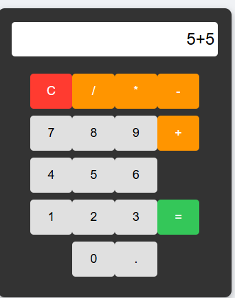
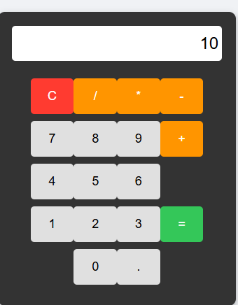
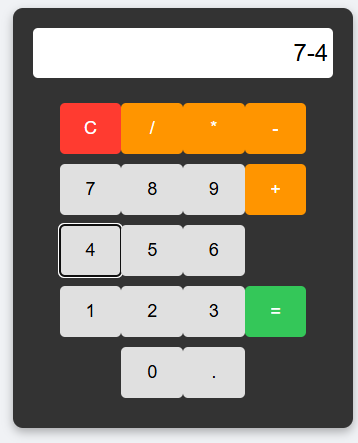
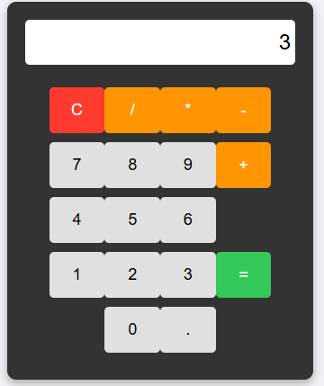
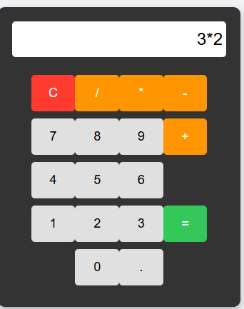
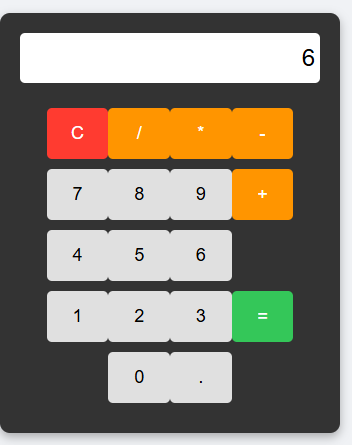

# Calculadora 

Este projeto é uma calculadora simples desenvolvida para a atividade prática da Aula 06 - Introdução ao JavaScript. A aplicação realiza as quatro operações matemáticas básicas.

## Tecnologias Utilizadas
* HTML5: Estruturação dos botões e do visor.
* CSS3: Estilização e posicionamento visual dos elementos.
* JavaScript: Lógica de programação para as funções de cálculo.

## Como as Funcionalidades Foram Implementadas
1. adicionarAoDisplay: Captura o número ou operador clicado e insere no visor.
2. limparTudo: Limpa todo o conteúdo da tela, reiniciando o visor com o valor zero.
3. Processamento: Ao clicar no botão de igual, a conta é processada e exibe o resultado final.

## Demonstração das Operações

### Soma
Conta Digitada:

Resultado Final:

### Subtração
Conta Digitada:

Resultado Final:

### Multiplicação
Conta Digitada:

Resultado Final:

### Divisão
Conta Digitada:

Resultado Final:

